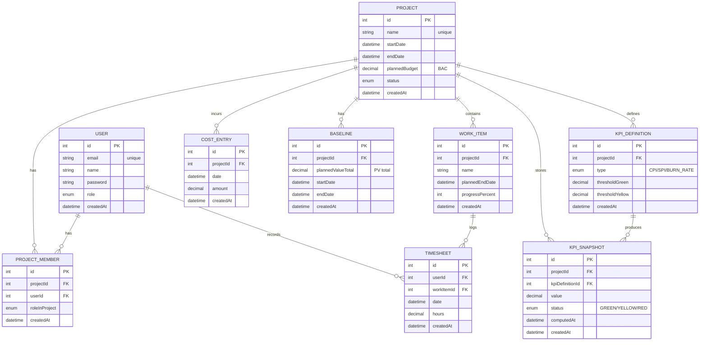

This is a [Next.js](https://nextjs.org) project bootstrapped with [`create-next-app`](https://nextjs.org/docs/app/api-reference/cli/create-next-app).

---

## Local Development — One-command run

This section describes how to run the project locally from scratch. Following these steps allows any evaluator or developer to reproduce the demo environment without additional setup.

---

## Prerequisites

Make sure the following tools are installed:

- **Node.js** >= 18
- **Docker Desktop** (with Docker Compose enabled)

Verify installation:

```bash
node -v
docker --version
docker compose version
```

---

## Environment variables

The application uses environment variables for database configuration.

1. Create a local environment file:

```bash
cp .env.example .env
```

2. No additional changes are required for local development when using Docker Compose.

---

## Start the application (local)

Run the following commands **in order**, from the project root:

### 1. Start PostgreSQL database

```bash
docker compose up -d
```

This starts a local PostgreSQL instance with persistent storage.

---

### 2. Install dependencies

```bash
npm install
```

---

### 3. Run database migrations

```bash
npx prisma migrate dev
```

This creates the database schema based on Prisma migrations.

---

### 4. Seed demo data

```bash
npx prisma db seed
```

This inserts:

- one **admin user** (demo only)
- one **sample project** ("Project Alpha")

---

### 5. Start the development server

```bash
npm run dev
```

The application will be available at:

```
http://localhost:3000
```

---

## Verification — Health Check

To verify that both the application and the database are running correctly, open:

```
http://localhost:3000/api/health
```

Expected response when the database is reachable:

```json
{
  "status": "ok",
  "db": "ok"
}
```

If the database is not reachable, the response will be:

```json
{
  "status": "ok",
  "db": "down"
}
```

---

## Demo Seed Data (Development Only)

For demo and testing purposes, the database is seeded with the following data:

### Admin user

- Email: `admin@demo.local`
- Password: `admin123`
- Role: `ADMIN`

### Demo project

- Name: `Project Alpha`

> ⚠️ **Important:** These credentials are intended **only for development and demo purposes**. Authentication is not implemented in the MVP and will be addressed in later iterations.

---

## Code quality

- Lint: `npm run lint` (Next.js ESLint)
- Format: `npm run format` (Prettier)

Recommended before pushing:

- `npm run lint`
- `npm run format`

---

## Notes

- PostgreSQL is managed via Docker Compose.
- All database schema changes are handled through Prisma migrations.
- The project is designed to be fully reproducible by following the steps above.

---

## Status

**EPIC 1 — Project Foundation & Environment: DONE**

# Capitolul 3 — Modelul de date (MVP)

## 3.1. Scop și principii de modelare

Modelul de date a fost proiectat pentru a susține un MVP al unui sistem informatic de monitorizare a performanței proiectelor bazat pe KPI, cu accent pe:

- colectarea datelor de execuție (timp și cost),
- definirea unui baseline (referință planificată),
- definirea KPI-urilor și stocarea istoricului (snapshot-uri),
- evitarea supramodelării (doar entități și câmpuri strict necesare).

Modelul este construit în jurul entității **Project**, care agregă execuția (WorkItem, Timesheet, CostEntry), planificarea (Baseline) și evaluarea performanței (KPIDefinition, KPISnapshot).

---

## 3.2. Dicționar de date (entitate → descriere → relații)

| Entitate          | Descriere (rol în domeniu)                                                                                     | Relații (cardinalități)                                                                                                      |
| ----------------- | -------------------------------------------------------------------------------------------------------------- | ---------------------------------------------------------------------------------------------------------------------------- |
| **User**          | Utilizator al sistemului (ex. admin, project manager). Poate înregistra timp și poate face parte din proiecte. | 1—N cu **Timesheet**; N—M cu **Project** prin **ProjectMember**                                                              |
| **Project**       | Unitatea centrală de monitorizare: interval, buget planificat (BAC), status. Agregă datele de execuție și KPI. | 1—N cu **WorkItem**, **CostEntry**, **Baseline**, **KPIDefinition**, **KPISnapshot**; N—M cu **User** prin **ProjectMember** |
| **ProjectMember** | Entitate de asociere User–Project, necesară pentru relația N—M și atribute pe relație (rol în proiect).        | N—1 către **User** și N—1 către **Project**; constrângere unică (projectId, userId)                                          |
| **WorkItem**      | Activitate/Task din proiect. Permite urmărirea execuției și asocierea pontajului (Timesheet).                  | N—1 către **Project**; 1—N către **Timesheet**                                                                               |
| **Timesheet**     | Înregistrare de timp lucrat (actual), asociată unui utilizator și unei activități.                             | N—1 către **User**; N—1 către **WorkItem**                                                                                   |
| **CostEntry**     | Înregistrare de cost real (actual), la nivel de proiect (ex. cheltuieli, servicii).                            | N—1 către **Project**                                                                                                        |
| **Baseline**      | Referință planificată aprobată: plannedValueTotal (PV total) și interval de valabilitate.                      | N—1 către **Project**                                                                                                        |
| **KPIDefinition** | Definiție KPI per proiect (ex. CPI), cu praguri (green/yellow) pentru status.                                  | N—1 către **Project**; 1—N către **KPISnapshot**; unicitate (projectId, type)                                                |
| **KPISnapshot**   | Valoare KPI calculată la un moment în timp (istoric), cu status și timestamp de calcul.                        | N—1 către **Project**; N—1 către **KPIDefinition**                                                                           |

---

## 3.3. ERD (Mermaid) — print-friendly (alb-negru)

> Notă: diagrama de mai jos este orientată pe relații și cardinalități (model logic). Este compatibilă cu randare alb-negru (print).


